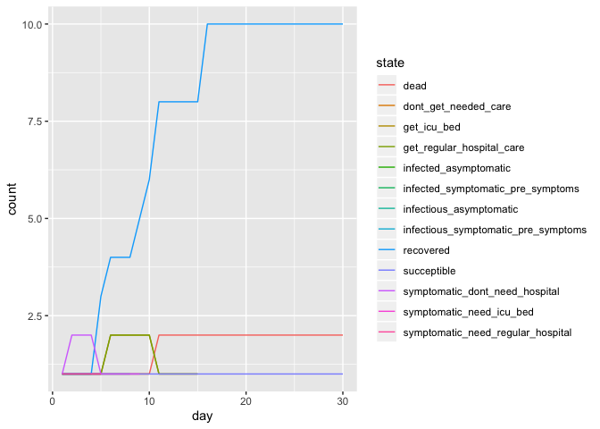

Modeling code
================
2020-03-30

## Initial Parameters

I am arbitrarily choosing XX,XXX people for my simulation. I am also
choosing a timeline similar to what we saw in NYC, with *ADD IN DATES
AND INFORMATION*.

``` r
initial_population_size = 10000 # TODO - choose bigger number later
total_days = 100

# TODO - fill these in with real numbers
day_of_first_distancing_guideline = 10
day_of_stronger_distancing_directive = 15
length_of_distancing_directive = 90
```

These initial parameters come from my best efforts at parsing the
literature, specificially *ARTICLE A and ARTICLE B*.

``` r
## BIG TODO: add citations for these numbers

#probability_symptomatic = 2/3 # Take this out?
probability_asymptomatic = 1/3

# TODO: break this out into it's own code chunk with explanation? Weighted average, solved equations to get 
basic_reproductive_number = 2.4
symptomatic_reproductive_number = basic_reproductive_number*(6/5)
asymptomatic_reproductive_number = basic_reproductive_number*(3/5)

time_until_infectious = 4 # This is figured from the incubation period, and rounded down from 4.6 so I can do steps in full days.

# For the asymptomatic types
asymptomatic_time_from_infectious_to_recovery = 4 # This is figured from the generation time (confusing). Should this be longer??

# For the symptomatic types
time_infectious_before_symptom_onset = 1
time_from_symptom_onset_to_recovery = 4

time_until_seeking_care = 5 # This is the number of days after symptom onset that people seek hospital care if they need it, on average
time_in_hospital_bed = 10
time_until_death_if_no_care = 10
```

These numbers come from *[NYC open data](link) and
[MODEL](https://columbia.maps.arcgis.com/apps/webappviewer/index.html?id=ade6ba85450c4325a12a5b9c09ba796c)
and its corresponding [scientific
paper](https://behcolumbia.files.wordpress.com/2020/04/flattening-the-curve-before-it-flattens-us-20200405b.pdf)*.

``` r
# Below is the sum of ICU beds in the 5 boroughs that could be made available
# in a medium patient surge response situation (i.e. by making other hospital beds available),
# according to the Columbia Severe COVID-19 Risk Mapping tool.

# This number is corroborated by a recent news article (3528 vs. 3500): https://www.businessinsider.com/coronavirus-nyc-more-than-doubled-its-icu-capacity-in-weeks-2020-4
total_nyc_icu_beds_medium_surge_response = 200 + 594 + 276 + 524 + 1934

total_nyc_population = 8398748 # https://www.census.gov/quickfacts/newyorkcitynewyork (2018 estimate)

icu_beds_per_person = total_nyc_icu_beds_medium_surge_response / total_nyc_population

initial_icu_bed_capacity = initial_population_size *  icu_beds_per_person

# This is the part that will be used in my model. It will decrease as people in the model use hospital beds.
icu_beds_available = round(initial_icu_bed_capacity)
```

``` r
# TODO - fill in distributions of: age, health status/underlying conditions, "essential" jobs, poverty levels, incarcerated, homeless, detained immigrants, insurance coverage 
```

These numbers come from ARTICLE A, describing the distribution by age of
who needs hospital care, and what their mortality rate is.

``` r
# This table is taken directly from the article
ferguson_et_al_table_1 = tibble(
  age_group_by_decade = 0:8,
  percent_symptomatic_requiring_hospital = c(.001, .003, .012, .032, .049, .102, .166, .243, .273),
  percent_hospital_cases_requiring_critical_care = c(.05, .05, .05, .05, .063, .122, .274, .432, .709),
  infection_fatality_ratio = c(.00002, .00006, .0003, .0008, .0015, .006, .022, .051, .093)
)

# Here, I simplify their parameters to create a table of probabilities by age group to use in my model.
# Rather than splitting between people in the hospital who need critical care or not,
# I count anyone needing hospitalization as needing a bed.

# Rather than using the overall fatality by age group, I assume that the only people who die are people who:
# ... get infected, have symptoms, are sick enough to require hospital care,
# ... and either don't get to the hospital, or do but still die.

# To calculate that last probability (dying in the hospital even if you get care),
# I take the estimate from the article that "50% of those in critical care will die"
# and multiply that by the probability of requiring critical care for those in the hospital.
severity_by_age =
  ferguson_et_al_table_1 %>% 
  mutate(., prob_die_in_icu = 0.5*percent_hospital_cases_requiring_critical_care) %>% 
  rename(., prob_need_any_hospital = percent_symptomatic_requiring_hospital,
         prob_need_icu_bed = percent_hospital_cases_requiring_critical_care) %>% 
  select(., -infection_fatality_ratio)
```

And finally, based on some other research and best guesses:

``` r
# TODO: flesh out this section

probability_seek_care_insured = 1
probability_seek_care_uninsured = 0.5

# TODO: decide on cutoff poverty level for ignoring a stay-home directive
```

## States

The way I organized my thoughts for this project was to create a state
diagram (essentially a flow chart) to lay out all of the different
trajectories someone could take through this epidemic. Everyone starts
as “succeptible”, and from there you have different probabilities of
transitioning to other states, dependent on factors like random chance,
demographic characteristics, as well as actions taken by others (like
infecting you).

*TODO: put in an image of my state diagram*

``` r
SUCCEPTIBLE = "succeptible"

INFECTED_ASYMPTOMATIC = "infected_asymptomatic"
INFECTIOUS_ASYMPTOMATIC = "infectious_asymptomatic"

INFECTED_SYMPTOMATIC_PRE_SYMPTOMS = "infected_symptomatic_pre_symptoms"
INFECTIOUS_SYMPTOMATIC_PRE_SYMPTOMS = "infectious_symptomatic_pre_symptoms"

SYMPTOMATIC_NEED_REGULAR_HOSPITAL = "symptomatic_need_regular_hospital"
SYMPTOMATIC_NEED_ICU_BED = "symptomatic_need_icu_bed"
SYMPTOMATIC_DONT_NEED_HOSPITAL = "symptomatic_dont_need_hospital"

GET_REGULAR_HOSPITAL_CARE = "get_regular_hospital_care"
GET_ICU_BED = "get_icu_bed"
DONT_GET_NEEDED_CARE = "dont_get_needed_care"

RECOVERED = "recovered"
DEAD = "dead"
```

I used another state diagram to map out who is staying at home, and who
is still out and about.

*TODO: put in an image of my 2nd state diagram*

## Change states on each timestep

Helper functions:

``` r
# Set up an empty table with columns for each day in the simulation.
# When someone is randomly selected to be infected, I put a 1 in the spot corresponding to that person (row) on that day (column).
# This is referenced by the change_state function, to transition people from SUCCEPTIBLE to INFECTED.
newly_infected = tibble(
  person_ids = 1:initial_population_size,
)

for (i in 1:total_days) {
  newly_infected =
    add_column(
      newly_infected,
      !!str_c("day_", i) := 0
      )
}

# This function gets called a variable number of times when someone is contageous.
# They infect a random person, according to the specific parameters of the situation (taking into account who and how many people are staying at home.)
# When someone is infected, a 1 gets placed in the newly_infected table for that specific person on the day they're infected.
infect_someone = function(day){
  day_col = str_c("day_", day)
  
  succeptibles = which(newly_infected[[day_col]] == 0)
  person_to_infect = sample(succeptibles,1)
  
  # newly_infected[[day_col]][person_to_infect] <<- 1
  }

# remove this later, printing just for debugging
newly_infected
```

    ## # A tibble: 10,000 x 101
    ##    person_ids day_1 day_2 day_3 day_4 day_5 day_6 day_7 day_8 day_9 day_10
    ##         <int> <dbl> <dbl> <dbl> <dbl> <dbl> <dbl> <dbl> <dbl> <dbl>  <dbl>
    ##  1          1     0     0     0     0     0     0     0     0     0      0
    ##  2          2     0     0     0     0     0     0     0     0     0      0
    ##  3          3     0     0     0     0     0     0     0     0     0      0
    ##  4          4     0     0     0     0     0     0     0     0     0      0
    ##  5          5     0     0     0     0     0     0     0     0     0      0
    ##  6          6     0     0     0     0     0     0     0     0     0      0
    ##  7          7     0     0     0     0     0     0     0     0     0      0
    ##  8          8     0     0     0     0     0     0     0     0     0      0
    ##  9          9     0     0     0     0     0     0     0     0     0      0
    ## 10         10     0     0     0     0     0     0     0     0     0      0
    ## # … with 9,990 more rows, and 90 more variables: day_11 <dbl>, day_12 <dbl>,
    ## #   day_13 <dbl>, day_14 <dbl>, day_15 <dbl>, day_16 <dbl>, day_17 <dbl>,
    ## #   day_18 <dbl>, day_19 <dbl>, day_20 <dbl>, day_21 <dbl>, day_22 <dbl>,
    ## #   day_23 <dbl>, day_24 <dbl>, day_25 <dbl>, day_26 <dbl>, day_27 <dbl>,
    ## #   day_28 <dbl>, day_29 <dbl>, day_30 <dbl>, day_31 <dbl>, day_32 <dbl>,
    ## #   day_33 <dbl>, day_34 <dbl>, day_35 <dbl>, day_36 <dbl>, day_37 <dbl>,
    ## #   day_38 <dbl>, day_39 <dbl>, day_40 <dbl>, day_41 <dbl>, day_42 <dbl>,
    ## #   day_43 <dbl>, day_44 <dbl>, day_45 <dbl>, day_46 <dbl>, day_47 <dbl>,
    ## #   day_48 <dbl>, day_49 <dbl>, day_50 <dbl>, day_51 <dbl>, day_52 <dbl>,
    ## #   day_53 <dbl>, day_54 <dbl>, day_55 <dbl>, day_56 <dbl>, day_57 <dbl>,
    ## #   day_58 <dbl>, day_59 <dbl>, day_60 <dbl>, day_61 <dbl>, day_62 <dbl>,
    ## #   day_63 <dbl>, day_64 <dbl>, day_65 <dbl>, day_66 <dbl>, day_67 <dbl>,
    ## #   day_68 <dbl>, day_69 <dbl>, day_70 <dbl>, day_71 <dbl>, day_72 <dbl>,
    ## #   day_73 <dbl>, day_74 <dbl>, day_75 <dbl>, day_76 <dbl>, day_77 <dbl>,
    ## #   day_78 <dbl>, day_79 <dbl>, day_80 <dbl>, day_81 <dbl>, day_82 <dbl>,
    ## #   day_83 <dbl>, day_84 <dbl>, day_85 <dbl>, day_86 <dbl>, day_87 <dbl>,
    ## #   day_88 <dbl>, day_89 <dbl>, day_90 <dbl>, day_91 <dbl>, day_92 <dbl>,
    ## #   day_93 <dbl>, day_94 <dbl>, day_95 <dbl>, day_96 <dbl>, day_97 <dbl>,
    ## #   day_98 <dbl>, day_99 <dbl>, day_100 <dbl>

``` r
change_state = function(id, prev_state, day, population){ #TODO: Fix inputs elsewhere
  new_state = prev_state # The default is to stay at the same state. This always happens for RECOVERED or DEAD
  rand = .9 ## JUST FOR DEBUGGING
  #rand = runif(1) #Question: is it ok to use the same random number for every decision in this function?
  
  if (prev_state == SUCCEPTIBLE) {
    if (newly_infected[[str_c("day_", day)]][id] == 1) {
      if (rand <= probability_asymptomatic) {new_state = INFECTED_ASYMPTOMATIC}
      else {new_state = INFECTED_SYMPTOMATIC_PRE_SYMPTOMS}
    }
  }

  if (prev_state == INFECTED_ASYMPTOMATIC) {
    # wait 4 days before turning infectious
    earlier_state_to_check = population[[str_c("day_", day - time_until_infectious)]][id]
    if (!is.null(earlier_state_to_check) && earlier_state_to_check == INFECTED_ASYMPTOMATIC) {
      new_state = INFECTIOUS_ASYMPTOMATIC
      
      # infect others according to parameters
      # TODO - finish this section (infect how many people? on what days?)
      infect_someone(day + 1)
    }
  }

  if (prev_state == INFECTIOUS_ASYMPTOMATIC) {
    # wait 4 days before recovering
    earlier_state_to_check = population[[str_c("day_", day - asymptomatic_time_from_infectious_to_recovery)]][id]
    if (!is.null(earlier_state_to_check) && earlier_state_to_check == INFECTIOUS_ASYMPTOMATIC) {
      new_state = RECOVERED
    }
  }

  if (prev_state == INFECTED_SYMPTOMATIC_PRE_SYMPTOMS) {
    # wait 4 days before turning infectious
    earlier_state_to_check = population[[str_c("day_", day - time_until_infectious)]][id]
    if (!is.null(earlier_state_to_check) && earlier_state_to_check == INFECTED_SYMPTOMATIC_PRE_SYMPTOMS) {
      new_state = INFECTIOUS_SYMPTOMATIC_PRE_SYMPTOMS
      
      # infect others according to parameters
      # TODO - finish this section (infect how many people? on what days?)
      infect_someone(day + 1)
    }
  }

  if (prev_state == INFECTIOUS_SYMPTOMATIC_PRE_SYMPTOMS) {
    # wait 1 day before turning symptomatic. severity of illness is based on demographics
    earlier_state_to_check = population[[str_c("day_", day - time_infectious_before_symptom_onset)]][id]
    if (!is.null(earlier_state_to_check) && earlier_state_to_check == INFECTIOUS_SYMPTOMATIC_PRE_SYMPTOMS) {
      if (rand < 0.2) { # TODO - instead of being a number, rely on a table: severity_by_age$prob_need_hospital
        if (rand < 0.1) { # for this random number, maybe do .2*.1? severity_by_age$prob_need_icu
          new_state = SYMPTOMATIC_NEED_ICU_BED
        } else {
          new_state = SYMPTOMATIC_NEED_REGULAR_HOSPITAL
        }
      } else { 
        new_state = SYMPTOMATIC_DONT_NEED_HOSPITAL
      }
    }
  }

  if (prev_state == SYMPTOMATIC_NEED_ICU_BED) {
    # seek care with 5 day delay or don't, depending on demographics
    earlier_state_to_check = population[[str_c("day_", day - time_until_seeking_care)]][id]
    if (!is.null(earlier_state_to_check) && earlier_state_to_check == SYMPTOMATIC_NEED_ICU_BED) {
      if (rand < 0.3) { # If they don't seek care: # TODO - instead of being a number, rely on a table or function (to be filled in later)
        new_state = DONT_GET_NEEDED_CARE
      } else { # If they do seek care: either get care or don't, depending on bed availability
        if (icu_beds_available > 0) {
          icu_beds_available = icu_beds_available - 1
          new_state = GET_ICU_BED
        } else {
          new_state = DONT_GET_NEEDED_CARE
        }
      }
    }
  }

  if (prev_state == SYMPTOMATIC_NEED_REGULAR_HOSPITAL) {
    # seek care with 5 day delay or don't, depending on demographics
    earlier_state_to_check = population[[str_c("day_", day - time_until_seeking_care)]][id]
    if (!is.null(earlier_state_to_check) && earlier_state_to_check == SYMPTOMATIC_NEED_REGULAR_HOSPITAL) {
      if (rand < 0.3) { # If they don't seek care: # TODO - instead of being a number, rely on a table or function (to be filled in later)
        new_state = DONT_GET_NEEDED_CARE
      } else {
        new_state = GET_REGULAR_HOSPITAL_CARE
      }
    }
  }

  if (prev_state == SYMPTOMATIC_DONT_NEED_HOSPITAL) {
    # wait 4 days then recover
    earlier_state_to_check = population[[str_c("day_", day - time_from_symptom_onset_to_recovery)]][id]
    if (!is.null(earlier_state_to_check) && earlier_state_to_check == SYMPTOMATIC_DONT_NEED_HOSPITAL) {
      new_state = RECOVERED
    }
  }

  if (prev_state == GET_ICU_BED) {
    # after 10 days in bed, probabalistically die or recover
    earlier_state_to_check = population[[str_c("day_", day - time_in_hospital_bed)]][id]
    if (!is.null(earlier_state_to_check) && earlier_state_to_check == GET_ICU_BED) {
      if (rand < 0.5) { # TODO - instead of being a number, rely on a table: severity_by_age$prob_die_in_ICU
        new_state = DEAD
      } else {
        new_state = RECOVERED
      }
      icu_beds_available = icu_beds_available + 1
    }
  }
  
  if (prev_state == GET_REGULAR_HOSPITAL_CARE) {
    # after 10 days in bed, recover
    earlier_state_to_check = population[[str_c("day_", day - time_in_hospital_bed)]][id]
    if (!is.null(earlier_state_to_check) && earlier_state_to_check == GET_REGULAR_HOSPITAL_CARE) {
      new_state = RECOVERED
    }
  }

  if (prev_state == DONT_GET_NEEDED_CARE) {
    # die after 10 days
    earlier_state_to_check = population[[str_c("day_", day - time_until_death_if_no_care)]][id]
    if (!is.null(earlier_state_to_check) && earlier_state_to_check == DONT_GET_NEEDED_CARE) {
      new_state = DEAD
    }
  }

  # Take out later, for debugging
  # cat("\n\nPerson ID: ", id)
  # cat("\nDay: ", day)
  # cat("\nPrevious state: ", prev_state)
  # cat("\nRandom number: ", rand)
  # cat("\nNew state: ", new_state)

  new_state
}
```

## Setting up and populating my dataframe

``` r
# TODO: create the population according to demographic markers, and randomly assign the infected person.
create_initial_population_with_one_infected = function(size){
  one_infected = c(INFECTED_SYMPTOMATIC_PRE_SYMPTOMS)
  others_succeptible = rep(c(SUCCEPTIBLE), size - 1)
  
  c(one_infected, others_succeptible)
}

one_of_each_state = function(size){
  c(SUCCEPTIBLE,
    INFECTED_ASYMPTOMATIC,
    INFECTIOUS_ASYMPTOMATIC,
    INFECTED_SYMPTOMATIC_PRE_SYMPTOMS,
    INFECTIOUS_SYMPTOMATIC_PRE_SYMPTOMS,
    SYMPTOMATIC_NEED_REGULAR_HOSPITAL,
    SYMPTOMATIC_NEED_ICU_BED,
    SYMPTOMATIC_DONT_NEED_HOSPITAL,
    GET_REGULAR_HOSPITAL_CARE,
    GET_ICU_BED,
    DONT_GET_NEEDED_CARE,
    RECOVERED,
    DEAD)
}

# OLD CODE: using factors. Don't delete until I've figured it out.
# create_initial_population_with_one_infected = function(size){
#   one_infected = as.factor(c(INFECTED_SYMPTOMATIC_PRE_SYMPTOMS))
#   others_succeptible = rep(as.factor(c(SUCCEPTIBLE)), size - 1)
#   
#   fct_c(one_infected, others_succeptible)
# }

# remove this later, printing just for debugging
#create_initial_population_with_one_infected(initial_population_size)
```

This is a table with each row representing one person in the population.
The first few columns include demographic and other information about a
person, and all of the columns labeled `day_n` represent that person’s
disease state at time
n.

``` r
# TODO: decide what to do about states as factors. Currently I just made everything strings because I couldn't keep things straight.
run_simulation = function(initial_population_size, initial_population_function, total_days) {
  population = tibble(
    person_ids = 1:initial_population_size,
    day_1 = initial_population_function(initial_population_size)
  )
  
  for (day in 2:total_days) {
    prev_day = population[[(str_c("day_", day - 1))]]
    population =
      add_column(
        population,
        !!str_c("day_", day) := flatten_chr(map2(population$person_ids, prev_day, change_state, day, population))
      )
  }
  
  population
}

#population = run_simulation(initial_population_size, create_initial_population_with_one_infected, total_days)
population = run_simulation(13, one_of_each_state, 30)
population
```

    ## # A tibble: 13 x 31
    ##    person_ids day_1 day_2 day_3 day_4 day_5 day_6 day_7 day_8 day_9 day_10
    ##         <int> <chr> <chr> <chr> <chr> <chr> <chr> <chr> <chr> <chr> <chr> 
    ##  1          1 succ… succ… succ… succ… succ… succ… succ… succ… succ… succe…
    ##  2          2 infe… infe… infe… infe… infe… infe… infe… infe… reco… recov…
    ##  3          3 infe… infe… infe… infe… reco… reco… reco… reco… reco… recov…
    ##  4          4 infe… infe… infe… infe… infe… symp… symp… symp… symp… recov…
    ##  5          5 infe… symp… symp… symp… symp… reco… reco… reco… reco… recov…
    ##  6          6 symp… symp… symp… symp… symp… get_… get_… get_… get_… get_r…
    ##  7          7 symp… symp… symp… symp… symp… get_… get_… get_… get_… get_i…
    ##  8          8 symp… symp… symp… symp… reco… reco… reco… reco… reco… recov…
    ##  9          9 get_… get_… get_… get_… get_… get_… get_… get_… get_… get_r…
    ## 10         10 get_… get_… get_… get_… get_… get_… get_… get_… get_… get_i…
    ## 11         11 dont… dont… dont… dont… dont… dont… dont… dont… dont… dont_…
    ## 12         12 reco… reco… reco… reco… reco… reco… reco… reco… reco… recov…
    ## 13         13 dead  dead  dead  dead  dead  dead  dead  dead  dead  dead  
    ## # … with 20 more variables: day_11 <chr>, day_12 <chr>, day_13 <chr>,
    ## #   day_14 <chr>, day_15 <chr>, day_16 <chr>, day_17 <chr>, day_18 <chr>,
    ## #   day_19 <chr>, day_20 <chr>, day_21 <chr>, day_22 <chr>, day_23 <chr>,
    ## #   day_24 <chr>, day_25 <chr>, day_26 <chr>, day_27 <chr>, day_28 <chr>,
    ## #   day_29 <chr>, day_30 <chr>

## Visualization

First, transform the table into a better shape for graphing, by getting
the total state counts at each time step.

``` r
# TODO:
# 1. combine into infected: all but succeptible, recocered, dead
# 2. combine into need hospital care: get_hospital_care, dont_get_needed_care
population_to_visualize =
  pivot_longer(
    population,
    cols = starts_with("day_"),
    names_to = "day",
    values_to = "state",
    names_prefix = "day_"
  ) %>% 
  mutate(day = as.numeric(day)) %>% 
  group_by(day, state) %>%
  summarize(count = n())

## NOTE:
## For transitory states like "infected", the count represents how many people are infected on that day.
## However, for a state like "dead", the count represents how many people total have died up until that point (because once you reach the "dead" state, you stay at that state forever).


# remove this later, printing just for debugging
population_to_visualize
```

    ## # A tibble: 167 x 3
    ## # Groups:   day [30]
    ##      day state                               count
    ##    <dbl> <chr>                               <int>
    ##  1     1 dead                                    1
    ##  2     1 dont_get_needed_care                    1
    ##  3     1 get_icu_bed                             1
    ##  4     1 get_regular_hospital_care               1
    ##  5     1 infected_asymptomatic                   1
    ##  6     1 infected_symptomatic_pre_symptoms       1
    ##  7     1 infectious_asymptomatic                 1
    ##  8     1 infectious_symptomatic_pre_symptoms     1
    ##  9     1 recovered                               1
    ## 10     1 succeptible                             1
    ## # … with 157 more rows

Graph the person-count of each state in a different color, with days on
the x-axis.

``` r
# TODO:
# 1. graph straight line for hospital bed capacity
# 2. add counts and rates for: total dead, total cases, number never sick, total denied care b/c over capacity (not the same as didn't seek care)
ggplot(population_to_visualize, 
       aes(x = day, y = count, color = state)) + 
  geom_line()
```

<!-- -->
