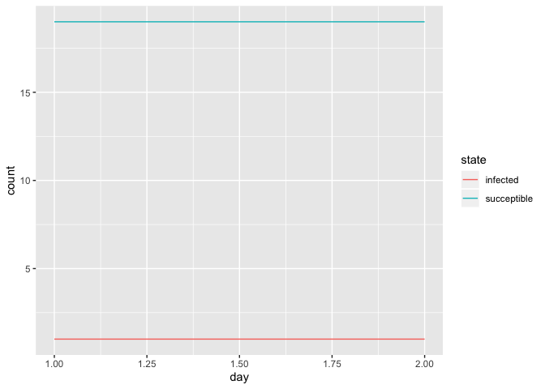

Modeling code
================
2020-03-30

## Initial Parameters

``` r
initial_population_size = 20
```

## States

``` r
INFECTED = "infected"
SUCCEPTIBLE = "succeptible"
RECOVERED = "recovered"
DEAD = "dead"
```

## Change states on each timestep

``` r
# placeholder function that just returns the same state
change_state = function(prev_state){
  as.character(prev_state)
}
```

## Setting up and populating my dataframe

``` r
# TODO: create the population according to demographic markers, and randomly assign the infected person.
create_initial_population_with_one_infected = function(size){
  one_infected = as.factor(c(INFECTED))
  others_succeptible = rep(as.factor(c(SUCCEPTIBLE)), size - 1)
  
  fct_c(one_infected, others_succeptible)
}

# remove this later, printing just for debugging
create_initial_population_with_one_infected(initial_population_size)
```

    ##  [1] infected    succeptible succeptible succeptible succeptible succeptible
    ##  [7] succeptible succeptible succeptible succeptible succeptible succeptible
    ## [13] succeptible succeptible succeptible succeptible succeptible succeptible
    ## [19] succeptible succeptible
    ## Levels: infected succeptible

This is a table with each row representing one person in the population.
The first few columns include demographic and other information about a
person, and all of the columns labeled `day_n` represent that person’s
disease state at time
n.

``` r
# TODO: make a function to generate new day columns based on some initial parameter.
population = tibble(
  person_ids = 1:initial_population_size,
  day_1 = create_initial_population_with_one_infected(initial_population_size)
) %>% 
  mutate(., day_2 = as.factor(map_chr(day_1, change_state)))

# remove this later, printing just for debugging
population
```

    ## # A tibble: 20 x 3
    ##    person_ids day_1       day_2      
    ##         <int> <fct>       <fct>      
    ##  1          1 infected    infected   
    ##  2          2 succeptible succeptible
    ##  3          3 succeptible succeptible
    ##  4          4 succeptible succeptible
    ##  5          5 succeptible succeptible
    ##  6          6 succeptible succeptible
    ##  7          7 succeptible succeptible
    ##  8          8 succeptible succeptible
    ##  9          9 succeptible succeptible
    ## 10         10 succeptible succeptible
    ## 11         11 succeptible succeptible
    ## 12         12 succeptible succeptible
    ## 13         13 succeptible succeptible
    ## 14         14 succeptible succeptible
    ## 15         15 succeptible succeptible
    ## 16         16 succeptible succeptible
    ## 17         17 succeptible succeptible
    ## 18         18 succeptible succeptible
    ## 19         19 succeptible succeptible
    ## 20         20 succeptible succeptible

## Visualization

First, transform the table into a better shape for graphing, by getting
the total state counts at each time step.

``` r
population_to_visualize =
  pivot_longer(
    population,
    cols = starts_with("day_"),
    names_to = "day",
    values_to = "state",
    names_prefix = "day_"
  ) %>% 
  mutate(day = as.numeric(day)) %>% 
  group_by(day, state) %>% 
  summarize(count = n())

# remove this later, printing just for debugging
population_to_visualize
```

    ## # A tibble: 4 x 3
    ## # Groups:   day [2]
    ##     day state       count
    ##   <dbl> <fct>       <int>
    ## 1     1 infected        1
    ## 2     1 succeptible    19
    ## 3     2 infected        1
    ## 4     2 succeptible    19

Graph the person-count of each state in a different color, with days on
the x-axis.

``` r
ggplot(population_to_visualize, 
       aes(x=day, y=count, color=state)) + 
  geom_line()
```

<!-- -->
