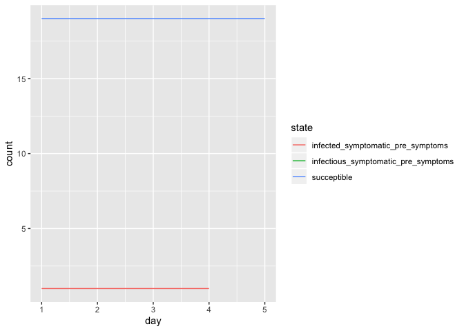

Modeling code
================
2020-03-30

Introduction… caveats, motivation (fun, learning R, learning about
disease modeling, practice reading research papers), etc. Who is this
document for? Link to blog post.

# Initial Parameters

I decided to base the parameters for my simulation off of New York City,
since that’s where I live. I am also choosing a timeline similar to what
we saw in NYC, with *ADD IN DATES AND INFORMATION*.

``` r
total_nyc_population = 8398748

initial_population_size = 10000 # TODO - choose bigger number later
total_days = 100 # TODO - choose a number that maks sense (when we'd all definitely still be staying home, so no longer than today - march 1)

day_of_first_distancing_guideline = 16
day_of_stronger_distancing_directive = 23
length_of_distancing_directive = 90 # do I ever use this? probably not, so remove

## From [wikipedia](https://en.wikipedia.org/wiki/COVID-19_pandemic_in_New_York_(state))
# March 1: first confirmed case in NYC (although this article things there were already 10,700 cases by then: https://www.nytimes.com/2020/04/23/us/coronavirus-early-outbreaks-cities.html)
# March 7: state of emergency declared.
# March 12: gatherings of >500 banned
# March 16: schools closed
# Shelter in place started at 8pm on March 22 (counting as March 23, which was a Monday)
```

### What’s someone’s chance of getting sick? Of being asymptomatic? How long do they stay sick? How long is an average hospital stay? etc. etc. etc.

These probabilities and timings come from my best efforts at parsing the
literature, specificially *[ARTICLE A](LINK) and [ARTICLE B](LINK)*.

``` r
## BIG TODO: add citations and better explanationsfor these numbers

probability_asymptomatic = 1/3

time_until_infectious = 4 # This is figured from the incubation period, and rounded down from 4.6 so I can do steps in full days.

# For the asymptomatic types
asymptomatic_time_from_infectious_to_recovery = 4 # This is figured from the generation time (confusing). Should this be longer??

# For the symptomatic types
time_infectious_before_symptom_onset = 1
time_from_symptom_onset_to_recovery = 4

time_until_seeking_care = 5 # This is the number of days after symptom onset that people seek hospital care if they need it, on average
time_in_hospital_bed = 10
time_until_death_if_no_care = 10
```

R\_0\! It’s not so simple…*TODO: explain (system of equations, how it
changes)* (also from *[ARTICLE A](LINK)*).

``` r
basic_reproductive_number = 2.4
symptomatic_reproductive_number = basic_reproductive_number*(6/5)
asymptomatic_reproductive_number = basic_reproductive_number*(3/5)
```

The distribution of who needs hospital care by age group, and what their
mortality rate is. These numbers come from *ARTICLE A*.

<details>

<summary>Click to see code</summary>

``` r
# This table is taken directly from the article
ferguson_et_al_table_1 = tibble(
  age_group_by_decade = 0:8,
  percent_symptomatic_requiring_hospital = c(.001, .003, .012, .032, .049, .102, .166, .243, .273),
  percent_hospital_cases_requiring_critical_care = c(.05, .05, .05, .05, .063, .122, .274, .432, .709),
  infection_fatality_ratio = c(.00002, .00006, .0003, .0008, .0015, .006, .022, .051, .093)
)

# Here, I simplify their parameters to create a table of probabilities by age group to use in my model.
# Rather than splitting between people in the hospital who need critical care or not,
# I count anyone needing hospitalization as needing a bed.

# Rather than using the overall fatality by age group, I assume that the only people who die are people who:
# ... get infected, have symptoms, are sick enough to require hospital care,
# ... and either don't get to the hospital, or do but still die.

# To calculate that last probability (dying in the hospital even if you get care),
# I take the estimate from the article that "50% of those in critical care will die"
# and multiply that by the probability of requiring critical care for those in the hospital.
severity_by_age =
  ferguson_et_al_table_1 %>% 
  mutate(., prob_die_in_icu = 0.5*percent_hospital_cases_requiring_critical_care) %>% 
  rename(., prob_need_any_hospital = percent_symptomatic_requiring_hospital,
         prob_need_icu_bed = percent_hospital_cases_requiring_critical_care) %>% 
  select(., -infection_fatality_ratio)
```

</details>

| age\_group\_by\_decade | prob\_need\_any\_hospital | prob\_need\_icu\_bed | prob\_die\_in\_icu |
| ---------------------: | ------------------------: | -------------------: | -----------------: |
|                      0 |                     0.001 |                0.050 |             0.0250 |
|                      1 |                     0.003 |                0.050 |             0.0250 |
|                      2 |                     0.012 |                0.050 |             0.0250 |
|                      3 |                     0.032 |                0.050 |             0.0250 |
|                      4 |                     0.049 |                0.063 |             0.0315 |
|                      5 |                     0.102 |                0.122 |             0.0610 |
|                      6 |                     0.166 |                0.274 |             0.1370 |
|                      7 |                     0.243 |                0.432 |             0.2160 |
|                      8 |                     0.273 |                0.709 |             0.3545 |

Probability of seeking critical hospital care depending on insurance
status **[REFERENCE,
explain](https://www.kff.org/uninsured/issue-brief/key-facts-about-the-uninsured-population/)**:

``` r
probability_seek_care_insured = 0.96
probability_seek_care_uninsured = 0.79
```

### Who lives in NYC? Population demographics and characteristics:

*Note: I’m leaving out a lot of nuance in collecting these numbers\! Of
course the homeless and incarcerated populations aren’t evenly
distributed by age, or by insurance status, or by poverty level. And
they shouldn’t have the same probabilities of getting infected. But I
believe that if there is estimating error, I’m underestimating (why??).
Also not taking race or sex or gender into account\! Even though there’s
evidence of differences on both. (cite). I believe I’m underestimating
because I’m not taking into account the compounding of factors (like the
fact that frontline workers are more likely to have larger families (is
that true?) and therefore expose greater number of people.*

*What else am I leaving out?*

Age distribution in NYC, from the *[CENSUS
WEBSITE](https://data.census.gov/cedsci/table?q=new%20york%20city%20population&g=1600000US3651000&hidePreview=false&tid=ACSST1Y2018.S0101&vintage=2018&layer=VT_2018_160_00_PY_D1&cid=DP05_0001E)*.

<details>

<summary>Click to see code</summary>

``` r
acs_age_estimates =
  read_csv("./ACSST1Y2018.S0101_data_with_overlays_2020-04-19T143631.csv")

population_distribution_by_decade =
  acs_age_estimates %>% 
  select(., matches("S0101_C01_0(0[2-9]|1[0-9])E")) %>% 
  slice(., 2:2) %>% 
  rename_all(~c('00-04','05-09','10-14','15-19','20-24','25-29','30-34','35-39','40-44',
                '45-49','50-54','55-59','60-64', '65-69','70-74','75-79','80-84','85+')) %>% 
  pivot_longer(., everything(), names_to = "age_ranges", values_to = "estimate_numbers") %>% 
  mutate(., estimate_numbers = as.integer(estimate_numbers)) %>% 
  mutate(., decade = substring(age_ranges,1,1)) %>% 
  group_by(., decade) %>% 
  summarise(., num_people = sum(estimate_numbers)) %>% 
  mutate(., percent_of_total = num_people/sum(num_people))
```

</details>

| decade | num\_people | percent\_of\_total |
| :----- | ----------: | -----------------: |
| 0      |      987977 |          0.1176338 |
| 1      |      928860 |          0.1105951 |
| 2      |     1310104 |          0.1559880 |
| 3      |     1330850 |          0.1584581 |
| 4      |     1067863 |          0.1271455 |
| 5      |     1044798 |          0.1243993 |
| 6      |      872327 |          0.1038639 |
| 7      |      537499 |          0.0639975 |
| 8      |      318470 |          0.0379187 |

Chronic health condition distribution in NYC, from *[the NYC Department
of Health’s EpiQuery tool](https://a816-health.nyc.gov/hdi/epiquery/),
looking at 2017 data for chronic diseases and smoking status*.

<details>

<summary>Click to see code</summary>

``` r
# only for adults
# maybe don't even have a drop-down for this, and instead just hide the code?

chronic_condition_prevalence = tibble(
  condition = c("Current asthma", "Diabetes", "Current blood pressure medication", "Current smoker", "Former smoker"),
  prevalence = c(.04, .12, .75, .13, .19)
)
```

</details>

| condition                         | prevalence |
| :-------------------------------- | ---------: |
| Current asthma                    |       0.04 |
| Diabetes                          |       0.12 |
| Current blood pressure medication |       0.75 |
| Current smoker                    |       0.13 |
| Former smoker                     |       0.19 |

Number and distribution of “essential workers” in NYC, from this
*[excellent report from the comptroller’s
office](https://comptroller.nyc.gov/reports/new-york-citys-frontline-workers/)*.
*Explain here the age distribution and what I did*

<details>

<summary>Click to see code</summary>

``` r
# total number essential workers in NYC: 1038779
# 8% below poverty level, 24% below 200% of poverty level (so 16% in the middle space)
# 37% are over the age of 50. Distribute those between 50s and 60s (what split?), and distribute the rest evenly between 20s 30s 40s
```

</details>

Poverty levels in NYC, and health insurance status from *[the census
website](https://data.census.gov/cedsci/table?q=new%20york%20city%20health&g=1600000US3651000&tid=ACSDT1Y2018.B27016&t=Health&layer=VT_2018_160_00_PY_D1&vintage=2018&hidePreview=true)*.

<details>

<summary>Click to see code</summary>

``` r
## TODO: get rid of error, or just don't show it?

# I made a couple adjustments here to get the data to fit into the age categories I already have, which are by decade.
# I am using the "under 19" insurance and poverty levels for decades 0-9 and 10-19.
# I am using the "19-64" insurance and poverty levels for decades 20s, 30s, 40s, 50s
# And I'm using the "65+" insurance and poverty levels for the decades 60s, 70s, 80+
# I thought it would be more "fair"/conservatie for my representation of things,
# because health insurance rates go way up at 65, so I decided to over-count who has insurance
# by giving 60-year-olds the higher insurance rate. 

# I'm sure there's a better, quicker way to do this (including just copy-pasting from the online data), but this one really stumped me! It also takes an unusually long time to run this code block... so I'm sure there's something about R that I'm missing.
acs_poverty_age_insurance =
  read_csv("./ACSDT1Y2018.B27016_data_with_overlays_2020-04-25T105847.csv")
```

    ## Parsed with column specification:
    ## cols(
    ##   .default = col_character()
    ## )

    ## See spec(...) for full column specifications.

``` r
# these are the percent-of-poverty levels provied in the data (represented just by their upper limit)
poverty_levels_granular = c(.5, .99, 1.37, 1.49, 1.99, 2.49, 2.99, 3.99, 4)

# these are the broader bands I'd like to end up with
poverty_level_labels = ordered(c("Below 100%", "100-199%", "200-299%", "300-399%", "400% and over"))

# helper function
get_number_from_question_id = function(id) {
  zero_padded = str_pad(as.character(id), 3, "left", pad = "0")
  variable_name = paste(sep = "", "B27016_", zero_padded, "E")
  number = acs_poverty_age_insurance[[variable_name]][2]
  as.numeric(number)
}

all_poverty_levels = tibble(
    poverty_level_granular = numeric(),
    poverty_level          = factor(),
    total_people_in_level  = numeric(),
    under_19               = numeric(),
    under_19_insured       = numeric(),
    between_19_64          = numeric(),
    between_19_64_insured  = numeric(),
    over_64                = numeric(),
    over_64_insured        = numeric()
)

for (n in 1:length(poverty_levels_granular)) {
  base = 2 + (n - 1) * 22 # the poverty level bands start at variable 2, 24, 46, etc.
  all_poverty_levels = add_row(all_poverty_levels,
    poverty_level_granular = poverty_levels_granular[n],
    poverty_level          = poverty_level_labels[floor(poverty_levels_granular[n])+1],
    total_people_in_level  = get_number_from_question_id(base),
    under_19               = get_number_from_question_id(base + 1),
    under_19_insured       = get_number_from_question_id(base + 2),
    between_19_64          = get_number_from_question_id(base + 8),
    between_19_64_insured  = get_number_from_question_id(base + 9),
    over_64                = get_number_from_question_id(base + 15),
    over_64_insured        = get_number_from_question_id(base + 16)
  )
}

collapsed_poverty_levels = 
  all_poverty_levels %>% 
  group_by(., poverty_level) %>% 
  summarise(.,
    total_people_in_level = sum(total_people_in_level),
    under_19              = sum(under_19),
    under_19_insured      = sum(under_19_insured),
    between_19_64         = sum(between_19_64),
    between_19_64_insured = sum(between_19_64_insured),
    over_64               = sum(over_64),
    over_64_insured       = sum(over_64_insured)
    ) %>% 
  arrange(., factor(poverty_level, levels = poverty_level_labels))

# go from numbers to proportions
poverty_and_insurance_distribution = collapsed_poverty_levels %>% 
  mutate(.,
         percent_of_under_19_insured = under_19_insured / sum(under_19),
         percent_of_under_19_UNinsured = (under_19 - under_19_insured) / sum(under_19),
         percent_of_19_to_64_insured = between_19_64_insured / sum(between_19_64),
         percent_of_19_to_64_UNinsured = (between_19_64 - between_19_64_insured) / sum(between_19_64),
         percent_of_over_64_insured = over_64_insured / sum(over_64_insured),
         percent_of_over_64_UNinsured = (over_64 - over_64_insured) / sum(over_64_insured)
        ) %>% 
  select(., poverty_level,
         percent_of_under_19_insured,
         percent_of_under_19_UNinsured,
         percent_of_19_to_64_insured,
         percent_of_19_to_64_UNinsured,
         percent_of_over_64_insured,
         percent_of_over_64_UNinsured
         )
```

</details>

| poverty\_level | percent\_of\_population | percent\_uninsured |
| :------------- | ----------------------: | -----------------: |
| Below 100%     |                   17.28 |               8.28 |
| 100-199%       |                   18.13 |              10.18 |
| 200-299%       |                   13.92 |               9.48 |
| 300-399%       |                   11.66 |               8.96 |
| 400% and over  |                   39.02 |               4.07 |

Percentages of homeless and incarcerated people in NYC, from [the 2019
White House State of Homelessness in America
report](https://www.whitehouse.gov/wp-content/uploads/2019/09/The-State-of-Homelessness-in-America.pdf),
and [a 2019 NYC Department of Corrections
report](https://www1.nyc.gov/assets/doc/downloads/press-release/DOC_At%20a%20Glance-1st6_Months_FY2019_012919.pdf).

``` r
# TODO: explain how I got these numbers

homelessness_rate = 101.5/10000     # 0.01015
incarceration_rate = 20000/8398748  # 0.002381307

# income distribution of incarcerated folks, in the population in general, adjusted to 2014 dollars:
# https://www.prisonpolicy.org/reports/income.html
# ~60% below 200, ~20% at 200, ~20% at or above 300 -->
# below 100: 30%
# 1-200: 30%
# 2-300: 20%
# 3-400: 10% 
# 400+: 10%
```

### How many ICU beds are available?

I used the *[Columbia Severe COVID-19 Risk Mapping
Tool](https://columbia.maps.arcgis.com/apps/webappviewer/index.html?id=ade6ba85450c4325a12a5b9c09ba796c)
and its corresponding [scientific
paper](https://behcolumbia.files.wordpress.com/2020/04/flattening-the-curve-before-it-flattens-us-20200405b.pdf)*
to estimate how many ICU beds would be available at the start of the
epidemic. I added together the number of ICU beds for each of the 5 NYC
boroughs that the tool estimated could be made available in a medium
patient surge response situation (i.e. by turning other hospital beds
and spaces into ICU beds). This number is corroborated by a recent news
article, [Converted operating rooms and shuffled patients: How NYC
scrambled to turn 1,600 ICU beds
into 3,500…](https://www.businessinsider.com/coronavirus-nyc-more-than-doubled-its-icu-capacity-in-weeks-2020-4)
(the medium surge response estimate was 3,528).

<details>

<summary>Calculations</summary>

``` r
total_nyc_icu_beds_medium_surge_response = 200 + 594 + 276 + 524 + 1934

icu_beds_per_person = total_nyc_icu_beds_medium_surge_response / total_nyc_population

initial_simulation_icu_bed_capacity = initial_population_size *  icu_beds_per_person

icu_beds_available = round(initial_simulation_icu_bed_capacity)
```

</details>

    ## ICU beds available at the start of the simulation:  4

# States and transitions (need better title)

The way I organized my thoughts for this project was to create a state
diagram (essentially a flow chart) to lay out all of the different
trajectories someone could take through this epidemic. Everyone starts
as “succeptible”, and from there you have different probabilities of
transitioning to other states, dependent on factors like random chance,
demographic characteristics, as well as actions taken by others (like
infecting you).

*TODO: put in an image of my state diagram*

<details>

<summary>State variables</summary>

``` r
SUCCEPTIBLE = "succeptible"

INFECTED_ASYMPTOMATIC = "infected_asymptomatic"
INFECTIOUS_ASYMPTOMATIC = "infectious_asymptomatic"

INFECTED_SYMPTOMATIC_PRE_SYMPTOMS = "infected_symptomatic_pre_symptoms"
INFECTIOUS_SYMPTOMATIC_PRE_SYMPTOMS = "infectious_symptomatic_pre_symptoms"

SYMPTOMATIC_NEED_REGULAR_HOSPITAL = "symptomatic_need_regular_hospital"
SYMPTOMATIC_NEED_ICU_BED = "symptomatic_need_icu_bed"
SYMPTOMATIC_DONT_NEED_HOSPITAL = "symptomatic_dont_need_hospital"

GET_REGULAR_HOSPITAL_CARE = "get_regular_hospital_care"
GET_ICU_BED = "get_icu_bed"
DONT_GET_NEEDED_CARE = "dont_get_needed_care"

RECOVERED = "recovered"
DEAD = "dead"
```

</details>

I wrote out a function to figure out who is staying at home and who is
still out and about. For this, I used my intuition rather than relying
on research or statistics, because I don’t think any data is available
(yet) about who actually stayed home when and who didn’t after
government restrictions were put in place. Overall, here are the
assumptions I make in my code: 1. Someone who is homeless or
incarcerated cannot “stay home,” and is always going to be interacting
with others. 2. Someone in an “essential” job will only stay home if
they are experiencing COVID-19 symptoms. 3. When NYC schools closed,
everyone under 20 years old stayed home (I’ve only got ages by decade).
4. At that time (NYC schools closed, large events cancelled, but no
other government mandates), people who are living at \>400% of the
poverty level ([\> $51,040/yr for a 1-person
household](https://www.medicaidplanningassistance.org/federal-poverty-guidelines/))
are the only people who can voluntarilly stay home (ex. because their
jobs allow for work-from-home). People in “essential” jobs continue to
go to work, unless they are symptomatic. 5. Once New York adopted the
shelter-in-place/stay-at-home order, people who are living under 200% of
the poverty level ($25,520/yr) are not generally able to obey the order
(ex. need to keep working), but do stay home if they are experiencing
COVID-19 symptoms.

<details>

<summary>Code for stay\_home
function:</summary>

``` r
# this is only relevant for people who are not dead, and not in the hospital
# TODO: take into account age and date of school closure?
stay_home = function(id, state, day, essential_worker, poverty_level, homeless, incarcerated, age_group) {
  symptomatic_states = c(SYMPTOMATIC_NEED_REGULAR_HOSPITAL,
                        SYMPTOMATIC_NEED_ICU_BED,
                        SYMPTOMATIC_DONT_NEED_HOSPITAL,
                        DONT_GET_NEEDED_CARE)
  
  over_200_poverty = c("200-299%", "300-399%", "400% and over")

  if (homeless | incarcerated) {
    return (FALSE)
  }
  if (day < day_of_first_distancing_guideline) {
    return (FALSE)
  }
  else if (between(day, day_of_first_distancing_guideline, day_of_stronger_distancing_directive)) {
    if ((essential_worker & state %in% symptomatic_states) | (!essential_worker & poverty_level == "400% and over") | (age_group < 2)) {
      return (TRUE)
    } else {return (FALSE)}
  }
  else { # then we're in a time of stronger distancing directive
    if ((state %in% symptomatic_states) | (!essential_worker & poverty_level %in% over_200_poverty) | (age_group < 2)) {
      return (TRUE)
    } else {return (FALSE)}
  }
}
```

</details>

### Change states on each timestep

I created a set of helper functions: *explain, and break up into smaller
chunks*

``` r
# Set up an empty table with columns for each day in the simulation.
# When someone is randomly selected to be infected, I put a 1 in the spot corresponding to that person (row) on that day (column).
# This is referenced by the change_state function, to transition people from SUCCEPTIBLE to INFECTED.
newly_infected = tibble(
  person_ids = 1:initial_population_size,
)

for (i in 1:total_days) {
  newly_infected =
    add_column(
      newly_infected,
      !!str_c("day_", i) := 0
      )
}

# This function gets called a variable number of times when someone is contageous.
# They infect a random person, according to the specific parameters of the situation (taking into account who and how many people are staying at home.)
# When someone is infected, a 1 gets placed in the newly_infected table for that specific person on the day they're infected.
infect_someone = function(day){
  day_col = str_c("day_", day)
  
  succeptibles = which(newly_infected[[day_col]] == 0)
  person_to_infect = sample(succeptibles,1)
  
  # newly_infected[[day_col]][person_to_infect] <<- 1
  }

# remove this later, printing just for debugging
#newly_infected
```

Then, putting that all together, here’s the function to take someone’s
state yesterday, and transition them to a new state for today. *explain
better\!*

<details>

<summary>State transition code (I collapsed this because it is very
long)</summary>

``` r
change_state = function(id, prev_state, day, population){ #TODO: Fix inputs elsewhere
  new_state = prev_state # The default is to stay at the same state. This always happens for RECOVERED or DEAD
  rand = .9 ## JUST FOR DEBUGGING
  #rand = runif(1) #Question: is it ok to use the same random number for every decision in this function?
  
  if (prev_state == SUCCEPTIBLE) {
    if (newly_infected[[str_c("day_", day)]][id] == 1) {
      if (rand <= probability_asymptomatic) {new_state = INFECTED_ASYMPTOMATIC}
      else {new_state = INFECTED_SYMPTOMATIC_PRE_SYMPTOMS}
    }
  }

  if (prev_state == INFECTED_ASYMPTOMATIC) {
    # wait 4 days before turning infectious
    earlier_state_to_check = population[[str_c("day_", day - time_until_infectious)]][id]
    if (!is.null(earlier_state_to_check) && earlier_state_to_check == INFECTED_ASYMPTOMATIC) {
      new_state = INFECTIOUS_ASYMPTOMATIC
      
      # infect others according to parameters
      # TODO - finish this section (infect how many people? on what days?)
      infect_someone(day + 1)
    }
  }

  if (prev_state == INFECTIOUS_ASYMPTOMATIC) {
    # wait 4 days before recovering
    earlier_state_to_check = population[[str_c("day_", day - asymptomatic_time_from_infectious_to_recovery)]][id]
    if (!is.null(earlier_state_to_check) && earlier_state_to_check == INFECTIOUS_ASYMPTOMATIC) {
      new_state = RECOVERED
    }
  }

  if (prev_state == INFECTED_SYMPTOMATIC_PRE_SYMPTOMS) {
    # wait 4 days before turning infectious
    earlier_state_to_check = population[[str_c("day_", day - time_until_infectious)]][id]
    if (!is.null(earlier_state_to_check) && earlier_state_to_check == INFECTED_SYMPTOMATIC_PRE_SYMPTOMS) {
      new_state = INFECTIOUS_SYMPTOMATIC_PRE_SYMPTOMS
      
      # infect others according to parameters
      # TODO - finish this section (infect how many people? on what days?)
      infect_someone(day + 1)
    }
  }

  if (prev_state == INFECTIOUS_SYMPTOMATIC_PRE_SYMPTOMS) {
    # wait 1 day before turning symptomatic. severity of illness is based on demographics
    earlier_state_to_check = population[[str_c("day_", day - time_infectious_before_symptom_onset)]][id]
    if (!is.null(earlier_state_to_check) && earlier_state_to_check == INFECTIOUS_SYMPTOMATIC_PRE_SYMPTOMS) {
      if (rand < 0.2) { # TODO - instead of being a number, rely on a table: severity_by_age$prob_need_hospital
        if (rand < 0.1) { # for this random number, maybe do .2*.1? severity_by_age$prob_need_icu
          new_state = SYMPTOMATIC_NEED_ICU_BED
        } else {
          new_state = SYMPTOMATIC_NEED_REGULAR_HOSPITAL
        }
      } else { 
        new_state = SYMPTOMATIC_DONT_NEED_HOSPITAL
      }
    }
  }

  if (prev_state == SYMPTOMATIC_NEED_ICU_BED) {
    # seek care with 5 day delay or don't, depending on demographics
    earlier_state_to_check = population[[str_c("day_", day - time_until_seeking_care)]][id]
    if (!is.null(earlier_state_to_check) && earlier_state_to_check == SYMPTOMATIC_NEED_ICU_BED) {
      if (rand < 0.3) { # If they don't seek care: # TODO - instead of being a number, rely on a table or function (to be filled in later)
        new_state = DONT_GET_NEEDED_CARE
      } else { # If they do seek care: either get care or don't, depending on bed availability
        if (icu_beds_available > 0) {
          icu_beds_available = icu_beds_available - 1
          new_state = GET_ICU_BED
        } else {
          new_state = DONT_GET_NEEDED_CARE
        }
      }
    }
  }

  if (prev_state == SYMPTOMATIC_NEED_REGULAR_HOSPITAL) {
    # seek care with 5 day delay or don't, depending on demographics
    earlier_state_to_check = population[[str_c("day_", day - time_until_seeking_care)]][id]
    if (!is.null(earlier_state_to_check) && earlier_state_to_check == SYMPTOMATIC_NEED_REGULAR_HOSPITAL) {
      if (rand < 0.3) { # If they don't seek care: # TODO - instead of being a number, rely on a table or function (to be filled in later)
        new_state = DONT_GET_NEEDED_CARE
      } else {
        new_state = GET_REGULAR_HOSPITAL_CARE
      }
    }
  }

  if (prev_state == SYMPTOMATIC_DONT_NEED_HOSPITAL) {
    # wait 4 days then recover
    earlier_state_to_check = population[[str_c("day_", day - time_from_symptom_onset_to_recovery)]][id]
    if (!is.null(earlier_state_to_check) && earlier_state_to_check == SYMPTOMATIC_DONT_NEED_HOSPITAL) {
      new_state = RECOVERED
    }
  }

  if (prev_state == GET_ICU_BED) {
    # after 10 days in bed, probabalistically die or recover
    earlier_state_to_check = population[[str_c("day_", day - time_in_hospital_bed)]][id]
    if (!is.null(earlier_state_to_check) && earlier_state_to_check == GET_ICU_BED) {
      if (rand < 0.5) { # TODO - instead of being a number, rely on a table: severity_by_age$prob_die_in_ICU
        new_state = DEAD
      } else {
        new_state = RECOVERED
      }
      icu_beds_available = icu_beds_available + 1
    }
  }
  
  if (prev_state == GET_REGULAR_HOSPITAL_CARE) {
    # after 10 days in bed, recover
    earlier_state_to_check = population[[str_c("day_", day - time_in_hospital_bed)]][id]
    if (!is.null(earlier_state_to_check) && earlier_state_to_check == GET_REGULAR_HOSPITAL_CARE) {
      new_state = RECOVERED
    }
  }

  if (prev_state == DONT_GET_NEEDED_CARE) {
    # die after 10 days
    earlier_state_to_check = population[[str_c("day_", day - time_until_death_if_no_care)]][id]
    if (!is.null(earlier_state_to_check) && earlier_state_to_check == DONT_GET_NEEDED_CARE) {
      new_state = DEAD
    }
  }

  # Take out later, for debugging
  # cat("\n\nPerson ID: ", id)
  # cat("\nDay: ", day)
  # cat("\nPrevious state: ", prev_state)
  # cat("\nRandom number: ", rand)
  # cat("\nNew state: ", new_state)

  new_state
}
```

</details>

# Setting up and populating my dataframe

The simulation starts with one person who is infected and symptomatic,
chosen randomly from a population that reflects all of the NYC
demographics (age, occupations, health insurance status, etc.) from the
section
above.

``` r
# TODO: create the population according to demographic markers, and randomly assign the infected person.
# demographics to include: essential_worker, poverty_level, homeless, incarcerated, age_group, health_insurance, comorbidities
create_initial_population_with_one_infected = function(size){
  initial_population = tibble(
    person_ids = 1:size,
    essential_worker = rep(c(FALSE), size),
    poverty_level = rep(c("300-399%"), size),
    homeless = rep(c(FALSE), size),
    incarcerated = rep(c(FALSE), size),
    age_group = rep(c(1), size),
    health_insurance = rep(c(FALSE), size),
    comorbidities = rep(c(FALSE), size),
    day_1 = rep(c(SUCCEPTIBLE), size)
  )
  initial_population$day_1[sample(1:size, 1)] = INFECTED_SYMPTOMATIC_PRE_SYMPTOMS
  initial_population
  
  # one_infected = c(INFECTED_SYMPTOMATIC_PRE_SYMPTOMS)
  # others_succeptible = rep(c(SUCCEPTIBLE), size - 1)
  # 
  # c(one_infected, others_succeptible)
}

# remove this later, printing just for debugging
# initial_pop = create_initial_population_with_one_infected(10)
# for (i in 1:nrow(initial_pop)) {
#   person = initial_pop[i,]
#   cat(stay_home(id = person$person_ids,
#             state = person$day_1,
#             day = 27,
#             essential_worker = person$essential_worker,
#             poverty_level = person$poverty_level,
#             homeless = person$homeless,
#             incarcerated = person$incarcerated,
#             age_group = person$age_group))
# }
```

Here’s how I represent my population changing states over time: *figure
out how to display a smaller nicely-formatted version*

This is a table with each row representing one person in the population.
The first few columns include demographic and other information about a
person, and all of the columns labeled `day_n` represent that person’s
disease state at time
n.

``` r
# TODO: decide what to do about states as factors. Currently I just made everything strings because I couldn't keep things straight.
run_simulation = function(initial_population_size, initial_population_function, total_days) {
  # population = tibble(
  #   person_ids = 1:initial_population_size,
  #   day_1 = initial_population_function(initial_population_size)
  # )
  
  population = initial_population_function(initial_population_size) # this should give a tibble with cols: ids, demos, day 1 states
  
  for (day in 2:total_days) {
    prev_day = population[[(str_c("day_", day - 1))]]
    population =
      add_column(
        population,
        !!str_c("day_", day) := flatten_chr(map2(population$person_ids, prev_day, change_state, day, population))
      )
  }
  
  population
}

# delete later, just for debugging
#population = run_simulation(initial_population_size, create_initial_population_with_one_infected, total_days)
#population = run_simulation(13, one_of_each_state, 30)
population = run_simulation(20, create_initial_population_with_one_infected, 5)
#population
```

By the end, we’ve got a table with everyone in the population, all of
their demographic information, and a record of whether they were sick,
in the hospital, dead, etc. at each day over the course of the
simulation. Now it’s time to graph it\!

# Visualization

I decided that what I want to graph is: *explain*

First, I transform the table into a better shape for graphing, by
getting the total state counts at each time step.

``` r
# TODO:
# 1. combine into infected: all but succeptible, recocered, dead
# 2. combine into need hospital care: get_hospital_care, dont_get_needed_care
population_to_visualize =
  pivot_longer(
    population,
    cols = starts_with("day_"),
    names_to = "day",
    values_to = "state",
    names_prefix = "day_"
  ) %>% 
  mutate(day = as.numeric(day)) %>% 
  group_by(day, state) %>%
  summarize(count = n())

## NOTE:
## For transitory states like "infected", the count represents how many people are infected on that day.
## However, for a state like "dead", the count represents how many people total have died up until that point (because once you reach the "dead" state, you stay at that state forever).


# remove this later, printing just for debugging
#population_to_visualize
```

Then, I graph the person-count of each state in a different color, with
days on the x-axis.

``` r
# TODO:
# 1. graph straight line for hospital bed capacity
# 2. add counts and rates for: total dead, total cases, number never sick, total denied care b/c over capacity (not the same as didn't seek care)
ggplot(population_to_visualize, 
       aes(x = day, y = count, color = state)) + 
  geom_line()
```

<!-- -->

# Comparing different possible scenerios

The reason I did all the work to create this simulation in the first
place was because I wanted a visual answer to the question: **how would
the course of the epidemic in NYC have looked different if we’d started
off in a fundamentally more equitable and just society?**

So, taking the X different hypothetical situations I laid out in my
[blog post](LINK), I ran and visualized the simulation with different
initial populations.

<details>

<summary>Code for running the simulation X times</summary>

``` r
#code
```

</details>

``` r
#visualization for each one, compiled nicely to sit next to each other
```
