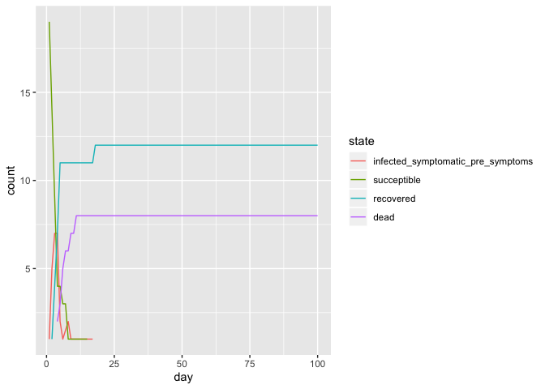

Modeling code
================
2020-03-30

## Initial Parameters

I am arbitrarily choosing XX,XXX people for my simulation. I am also
choosing a timeline similar to what we saw in NYC, with *ADD IN DATES
AND INFORMATION*.

``` r
initial_population_size = 20 # TODO - choose bigger number later
total_days = 100

# TODO - fill these in with real numbers
day_of_first_distancing_guideline = 10
day_of_stronger_distancing_directive = 15
length_of_distancing_directive = 90
```

These initial parameters come from my best efforts at parsing the
literature, specificially ARTICLE A and ARTICLE B.

``` r
## BIG TODO: add citations for these numbers

probability_symptomatic = 2/3
probability_asymptomatic = 1 - probability_symptomatic

# TODO: break this out into it's own code chunk with explanation? Weighted average, solved equations to get 
basic_reproductive_number = 2.4
symptomatic_reproductive_number = basic_reproductive_number*(6/5)
asymptomatic_reproductive_number = basic_reproductive_number*(3/5)

time_until_infectious = 4.5 # This is figured from the incubation period, and rounded down from 4.6 so I can do steps in half-days.

# For the asymptomatic types
asymptomatic_time_from_infectious_to_recovery = 4 # This is figured from the generation time (confusing). Should this be longer??

# For the symptomatic types
time_infectious_before_symptom_onset = 0.5
time_from_symptom_onset_to_recovery = 3.5

time_until_seeking_care = 5 # This is the number of days after symptom onset that people seek hospital care if they need it, on average
time_in_hospital_bed = 10.5
time_until_death_if_no_care = 10
```

These numbers come from NYC open data.

``` r
hospital_bed_capacity = 100 #TODO - fill in with real number later

# TODO - fill in distributions of: age, health status/underlying conditions, "essential" jobs, poverty levels, incarcerated, homeless, detained immigrants, insurance coverage 
```

These numbers come from ARTICLE A, describing the distribution by age of
who needs hospital care, and what their mortality rate is.

``` r
# TODO: fill in from article.
```

And finally, based on some other research and best guesses:

``` r
# TODO: flesh out this section

probability_seek_care_insured = 1
probability_seek_care_uninsured = 0.5

# TODO: decide on cutoff poverty level for ignoring a stay-home directive
```

## States

The way I organized my thoughts for this project was to create a state
diagram (essentially a flow chart) to lay out all of the different
trajectories someone could take through this epidemic. Everyone starts
as “succeptible”, and from there you have different probabilities of
transitioning to other states, dependent on factors like random chance,
demographic characteristics, as well as actions taken by others (like
infecting you).

*TODO: put in an image of my state diagram*

``` r
SUCCEPTIBLE = "succeptible"

INFECTED_ASYMPTOMATIC = "infected_asymptomatic"
INFECTIOUS_ASYMPTOMATIC = "infectious_asymptomatic"

INFECTED_SYMPTOMATIC_PRE_SYMPTOMS = "infected_symptomatic_pre_symptoms"
INFECTIOUS_SYMPTOMATIC_PRE_SYMPTOMS = "infectious_symptomatic_pre_symptoms"

SYMPTOMATIC_NEED_HOSPITAL = "symptomatic_need_hospital"
SYMPTOMATIC_DONT_NEED_HOSPITAL = "symptomatic_dont_need_hospital"

NEED_HOSPITAL_SEEK_CARE = "need_hospital_seek_care"
NEED_HOSPITAL_DONT_SEEK_CARE = "need_hospital_dont_seek_care"

GET_HOSPITAL_CARE = "get_hospital_care"
DONT_GET_NEEDED_CARE = "dont_get_needed_care"

RECOVERED = "recovered"
DEAD = "dead"
```

I used another state diagram to map out who is staying at home, and who
is still out and about.

*TODO: put in an image of my 2nd state diagram*

## Change states on each timestep

``` r
# placeholder function that just returns the same state
change_state = function(prev_state){
  as.character(prev_state)
}
```

## Setting up and populating my dataframe

``` r
# TODO: create the population according to demographic markers, and randomly assign the infected person.
create_initial_population_with_one_infected = function(size){
  one_infected = as.factor(c(INFECTED_SYMPTOMATIC_PRE_SYMPTOMS))
  others_succeptible = rep(as.factor(c(SUCCEPTIBLE)), size - 1)
  
  fct_c(one_infected, others_succeptible)
}

# remove this later, printing just for debugging
create_initial_population_with_one_infected(initial_population_size)
```

    ##  [1] infected_symptomatic_pre_symptoms succeptible                      
    ##  [3] succeptible                       succeptible                      
    ##  [5] succeptible                       succeptible                      
    ##  [7] succeptible                       succeptible                      
    ##  [9] succeptible                       succeptible                      
    ## [11] succeptible                       succeptible                      
    ## [13] succeptible                       succeptible                      
    ## [15] succeptible                       succeptible                      
    ## [17] succeptible                       succeptible                      
    ## [19] succeptible                       succeptible                      
    ## Levels: infected_symptomatic_pre_symptoms succeptible

This is a table with each row representing one person in the population.
The first few columns include demographic and other information about a
person, and all of the columns labeled `day_n` represent that person’s
disease state at time
n.

``` r
# TODO: make a function to generate new day columns based on some initial parameter.
population = tibble(
  person_ids = 1:initial_population_size,
  day_1 = create_initial_population_with_one_infected(initial_population_size)
)

for (i in 2:total_days) {
  prev_day = population[[(str_c("day_", i - 1))]]
  population =
    add_column(
      population,
      !!str_c("day_", i) := as.factor(map_chr(prev_day, change_state))
      )
  }

# remove this later, printing just for debugging
population
```

    ## # A tibble: 20 x 101
    ##    person_ids day_1 day_2 day_3 day_4 day_5 day_6 day_7 day_8 day_9 day_10
    ##         <int> <fct> <fct> <fct> <fct> <fct> <fct> <fct> <fct> <fct> <fct> 
    ##  1          1 infe… infe… infe… infe… infe… infe… infe… infe… infe… infec…
    ##  2          2 succ… succ… succ… succ… succ… succ… succ… succ… succ… succe…
    ##  3          3 succ… succ… succ… succ… succ… succ… succ… succ… succ… succe…
    ##  4          4 succ… succ… succ… succ… succ… succ… succ… succ… succ… succe…
    ##  5          5 succ… succ… succ… succ… succ… succ… succ… succ… succ… succe…
    ##  6          6 succ… succ… succ… succ… succ… succ… succ… succ… succ… succe…
    ##  7          7 succ… succ… succ… succ… succ… succ… succ… succ… succ… succe…
    ##  8          8 succ… succ… succ… succ… succ… succ… succ… succ… succ… succe…
    ##  9          9 succ… succ… succ… succ… succ… succ… succ… succ… succ… succe…
    ## 10         10 succ… succ… succ… succ… succ… succ… succ… succ… succ… succe…
    ## 11         11 succ… succ… succ… succ… succ… succ… succ… succ… succ… succe…
    ## 12         12 succ… succ… succ… succ… succ… succ… succ… succ… succ… succe…
    ## 13         13 succ… succ… succ… succ… succ… succ… succ… succ… succ… succe…
    ## 14         14 succ… succ… succ… succ… succ… succ… succ… succ… succ… succe…
    ## 15         15 succ… succ… succ… succ… succ… succ… succ… succ… succ… succe…
    ## 16         16 succ… succ… succ… succ… succ… succ… succ… succ… succ… succe…
    ## 17         17 succ… succ… succ… succ… succ… succ… succ… succ… succ… succe…
    ## 18         18 succ… succ… succ… succ… succ… succ… succ… succ… succ… succe…
    ## 19         19 succ… succ… succ… succ… succ… succ… succ… succ… succ… succe…
    ## 20         20 succ… succ… succ… succ… succ… succ… succ… succ… succ… succe…
    ## # … with 90 more variables: day_11 <fct>, day_12 <fct>, day_13 <fct>,
    ## #   day_14 <fct>, day_15 <fct>, day_16 <fct>, day_17 <fct>, day_18 <fct>,
    ## #   day_19 <fct>, day_20 <fct>, day_21 <fct>, day_22 <fct>, day_23 <fct>,
    ## #   day_24 <fct>, day_25 <fct>, day_26 <fct>, day_27 <fct>, day_28 <fct>,
    ## #   day_29 <fct>, day_30 <fct>, day_31 <fct>, day_32 <fct>, day_33 <fct>,
    ## #   day_34 <fct>, day_35 <fct>, day_36 <fct>, day_37 <fct>, day_38 <fct>,
    ## #   day_39 <fct>, day_40 <fct>, day_41 <fct>, day_42 <fct>, day_43 <fct>,
    ## #   day_44 <fct>, day_45 <fct>, day_46 <fct>, day_47 <fct>, day_48 <fct>,
    ## #   day_49 <fct>, day_50 <fct>, day_51 <fct>, day_52 <fct>, day_53 <fct>,
    ## #   day_54 <fct>, day_55 <fct>, day_56 <fct>, day_57 <fct>, day_58 <fct>,
    ## #   day_59 <fct>, day_60 <fct>, day_61 <fct>, day_62 <fct>, day_63 <fct>,
    ## #   day_64 <fct>, day_65 <fct>, day_66 <fct>, day_67 <fct>, day_68 <fct>,
    ## #   day_69 <fct>, day_70 <fct>, day_71 <fct>, day_72 <fct>, day_73 <fct>,
    ## #   day_74 <fct>, day_75 <fct>, day_76 <fct>, day_77 <fct>, day_78 <fct>,
    ## #   day_79 <fct>, day_80 <fct>, day_81 <fct>, day_82 <fct>, day_83 <fct>,
    ## #   day_84 <fct>, day_85 <fct>, day_86 <fct>, day_87 <fct>, day_88 <fct>,
    ## #   day_89 <fct>, day_90 <fct>, day_91 <fct>, day_92 <fct>, day_93 <fct>,
    ## #   day_94 <fct>, day_95 <fct>, day_96 <fct>, day_97 <fct>, day_98 <fct>,
    ## #   day_99 <fct>, day_100 <fct>

## Visualization

First, transform the table into a better shape for graphing, by getting
the total state counts at each time step.

``` r
population_to_visualize =
  pivot_longer(
    population,
    cols = starts_with("day_"),
    names_to = "day",
    values_to = "state",
    names_prefix = "day_"
  ) %>% 
  mutate(day = as.numeric(day)) %>% 
  group_by(day, state) %>% 
  summarize(count = n())

## NOTE:
## For transitory states like "infected", the count represents how many people are infected on that day.
## However, for a state like "dead", the count represents how many people total have died up until that point (because once you reach the "dead" state, you stay at that state forever).


# remove this later, printing just for debugging
population_to_visualize
```

    ## # A tibble: 200 x 3
    ## # Groups:   day [100]
    ##      day state                             count
    ##    <dbl> <fct>                             <int>
    ##  1     1 infected_symptomatic_pre_symptoms     1
    ##  2     1 succeptible                          19
    ##  3     2 infected_symptomatic_pre_symptoms     1
    ##  4     2 succeptible                          19
    ##  5     3 infected_symptomatic_pre_symptoms     1
    ##  6     3 succeptible                          19
    ##  7     4 infected_symptomatic_pre_symptoms     1
    ##  8     4 succeptible                          19
    ##  9     5 infected_symptomatic_pre_symptoms     1
    ## 10     5 succeptible                          19
    ## # … with 190 more rows

Graph the person-count of each state in a different color, with days on
the x-axis.

``` r
ggplot(population_to_visualize, 
       aes(x=day, y=count, color=state)) + 
  geom_line()
```

<!-- -->
